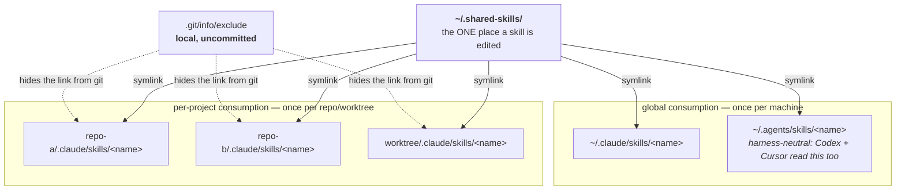
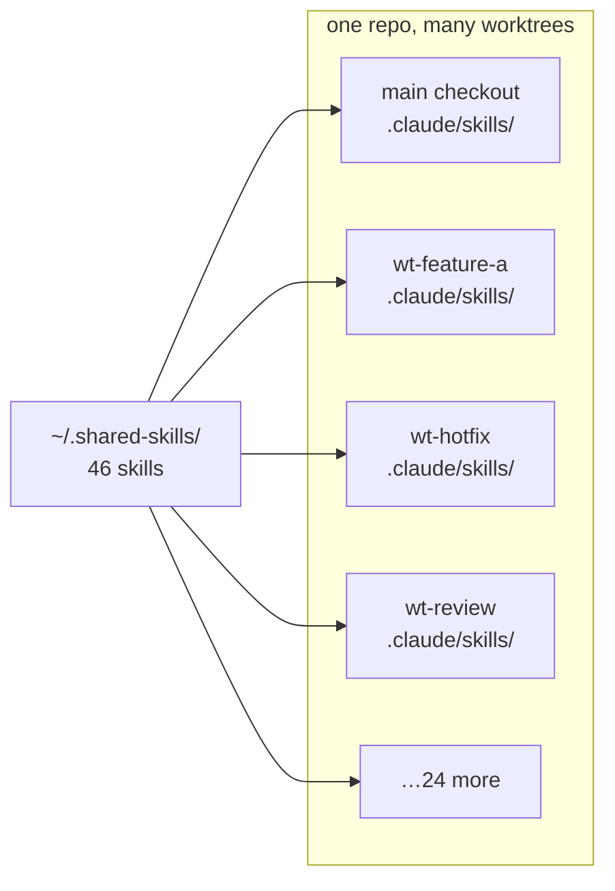
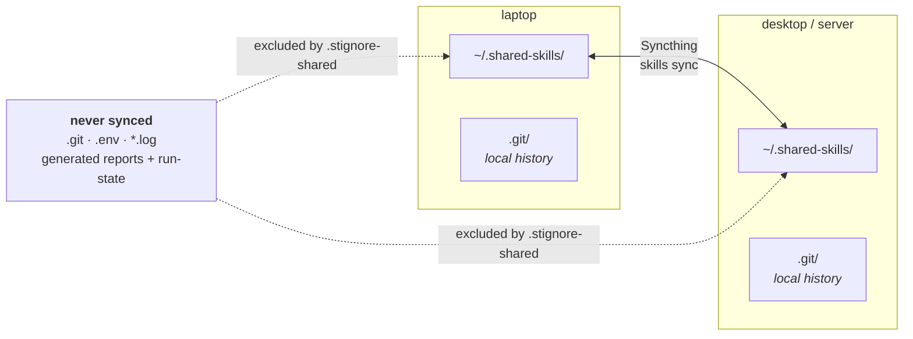
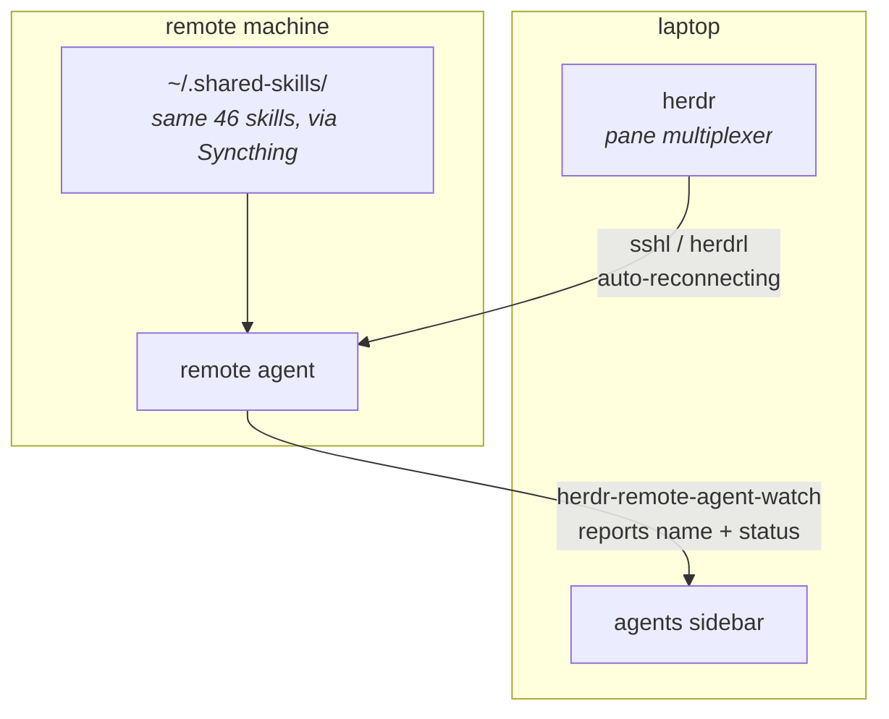
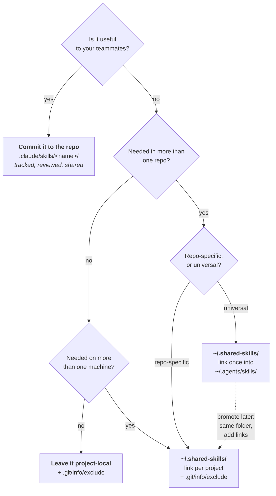

# The shared-skill harness

**One global folder is the source of truth for your AI-agent skills. Every
consumer reaches it by symlink.**

This repo documents a pattern, not a product. It is the architecture I run
across 8 repos, 27 git worktrees, and 2 machines: 46 skills stored once, reached
by 538 symlinks, invisible to every repo's git history, and identical on every
machine I ssh into.

It ships one reference implementation — the [`shared-skill`](skills/shared-skill/SKILL.md)
skill, which performs the linking and git-excluding — plus [config
templates](templates/). Everything else here is explanation.

---

## The problem

You write a skill that teaches your agent something useful. Then:

- **Copy it into each repo** → 8 copies that drift. You fix a bug in one and the
  other seven stay wrong.
- **Commit it into a work repo** → it lands in your teammates' diffs. Personal
  tooling becomes everyone's problem, and code review has to have an opinion
  about your prompt engineering.
- **Keep it in one repo** → it doesn't exist in the other seven, and your agent
  is dumber in every one of them.
- **Keep it on one machine** → it's gone the moment you ssh somewhere, which is
  exactly when you have the least patience for a missing tool.

Every one of these is a distribution problem wearing a different hat. The fix is
to separate **where a skill is stored** from **where it is visible**.

---

## The shape

Storage is global. Consumption is by symlink.



The property that makes it work: **a skill is edited in exactly one place and is
current everywhere immediately.** There is no build, no install, no version, no
sync step. A symlink is not a copy.

---

## Why `.git/info/exclude` and not `.gitignore`

This is the part people get wrong, and it's the whole reason the pattern is
invisible rather than merely tidy.

`.gitignore` is **committed**. If you add `.claude/skills/my-skill` to it, you
have told your entire team about a path only you have. You've traded a visible
symlink for a visible ignore rule — you haven't hidden anything, you've just
moved the evidence.

`.git/info/exclude` has identical syntax and identical effect, but lives inside
`.git/` and is **never committed, never pushed, never cloned**. The link is
invisible, *and the rule hiding it is invisible too*.

```bash
echo ".claude/skills/<name>" >> <project>/.git/info/exclude
```

That is the entire mechanism. Your repo stays clean for everyone else, and
nobody has to agree to anything.

---

## The worktree multiplier

This is what turns a nice idea into something that must be automated.



A new git worktree starts with an **empty** `.claude/skills/`. Nothing is
inherited from the main checkout — worktrees share history, not untracked
files, and these links are untracked by design.

So every `git worktree add` needs the full link set recreated. In my setup, 27
of 35 consuming directories are worktrees. At 46 skills that is not a thing you
do by hand twice, which is why the link step lives in a skill the agent runs for
you.

---

## Across machines

Syncthing keeps `~/.shared-skills` identical on every machine. Two rules make it
safe:



**`.git` must never sync.** Two machines replicating one index will corrupt it —
one writes mid-operation while the other replicates a half-written state. Each
machine keeps its own `.git`, and the private repo behind it is the history
layer, not the transport layer. Syncthing moves the working files; git records
what they were.

**Secrets never sync**, and generated output stays local — run-state, reports,
`node_modules`, anything a skill produces rather than sources. Diverging is
correct for those.

The ignore config itself is split so the rules can propagate without freezing:
`.stignore` is per-device and does nothing but `#include .stignore-shared`,
which *is* synced. Shared rules reach every peer; machine-specific ones stay put.

See [`templates/stignore-shared`](templates/stignore-shared).

---

## The ssh half

Once skills are identical on both machines, agents running *on the remote*
already have every capability the local ones do. What's left is being able to
see and drive them from one screen.



The remote agent has the same skills because Syncthing put them there. The
connection survives laptop sleep because the wrapper reconnects. And the remote
agent appears in the local sidebar with live status, so a machine you're not
looking at isn't a black box.

Each piece is its own repo:

| | |
|---|---|
| [`sshl`](https://github.com/alex-devdone/sshl) | auto-reconnecting ssh into a persistent remote tmux session |
| [`herdrl`](https://github.com/alex-devdone/herdrl) | the same for attaching a remote [herdr](https://herdr.dev) server |
| [`herdr-remote-agent-watch`](https://github.com/alex-devdone/herdr-remote-agent-watch) | surfaces an agent running behind ssh as a live agent in the local sidebar |
| [`herdr-sched`](https://github.com/alex-devdone/herdr-sched) | schedule a message to be typed into a pane later |

---

## Where should a new skill live?



The promotion path costs nothing, because every option after the first shares
one storage location. Moving a skill from "one project" to "everywhere" is
adding symlinks, not migrating anything.

---

## Why not the alternatives

**Git submodule.** Needs a commit in the host repo to register the submodule, so
your team sees it. That is the exact thing being avoided.

**Just commit the skills.** Same problem, plus every skill edit becomes a PR in
someone else's repo.

**iCloud / Dropbox / Google Drive.** They mangle symlinks and are unreliable
with dotfiles and dot-directories. Syncthing has `.stignore` for per-path
control, keeps no cloud copy of your work, and syncs peer-to-peer.

**A package manager.** Version skew across machines defeats the purpose. The
point is that a skill edited on the laptop is live on the server thirty seconds
later, with no publish step and no version to reconcile.

**A bare clone in each repo.** You're back to N copies, now with N remotes to
keep pushed.

---

## Sharp edges

Things that actually bit, in the order they bit:

- **Names must be globally unique.** Every shared skill is potentially visible in
  every project, so a generic name like `dep-graph` collides. Project-scoped
  ones take a service suffix: `dep-graph-myservice`.
- **Every new worktree needs the link set recreated.** See above — this is the
  main ongoing cost.
- **`.git` must stay out of the sync folder.** Non-negotiable; two machines will
  corrupt one index.
- **The source of truth can never itself be a symlink.** A Syncthing-synced
  folder can't hold a link pointing outside it — the other peer has no such
  path. So `~/.shared-skills/<name>` is always a real directory, and everything
  else points *at* it. This is why you extract *copies* for publishing rather
  than relocating the original.
- **The exclude list drifts.** Unlinking a skill leaves its `.git/info/exclude`
  entry behind. Mine currently carries three stale entries for links that no
  longer exist. Harmless, but it shows the link/exclude pairing is manual — a
  good argument for going through the skill instead of by hand, and for an
  occasional audit:

  ```bash
  # exclude entries with no link on disk
  grep -E "^\.claude/skills/" .git/info/exclude | while read -r e; do
    [ -e "$e" ] || echo "stale: $e"
  done
  ```

---

## Getting started

1. `mkdir ~/.shared-skills` and move a skill into it.
2. Install the [`shared-skill`](skills/shared-skill/SKILL.md) skill so your agent
   can do the linking: copy it to `~/.claude/skills/shared-skill/` (or
   `~/.agents/skills/` to reach Codex and Cursor too).
3. Ask it to link that skill into a project. It handles the symlink, the
   `git rm --cached` if the skill was previously committed, and the
   `.git/info/exclude` entry.
4. Optional, for multiple machines: add `~/.shared-skills` as a Syncthing folder
   and drop in [`templates/stignore`](templates/stignore) +
   [`templates/stignore-shared`](templates/stignore-shared).
5. Optional, to version it: `git init` inside `~/.shared-skills` with
   [`templates/gitignore`](templates/gitignore). Keep that repo **private** —
   it's where your unpublished tooling lives.

## License

MIT — see [LICENSE](LICENSE).
